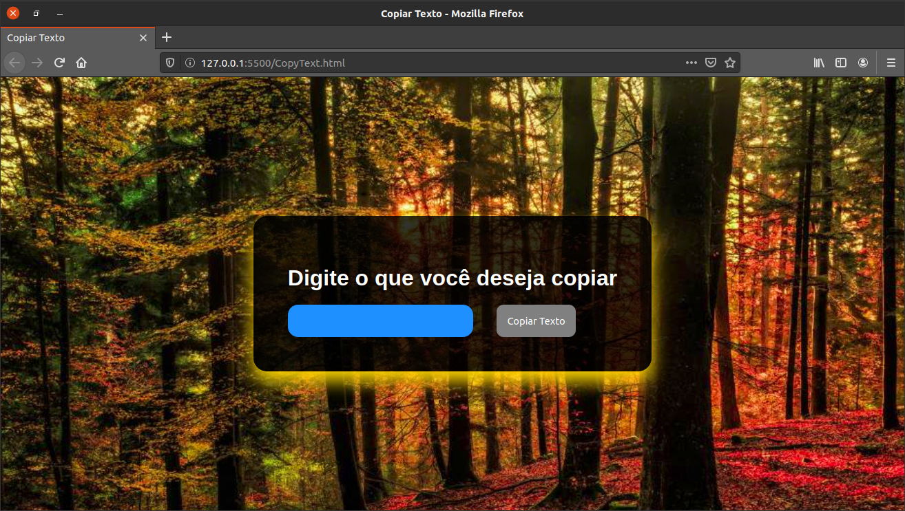
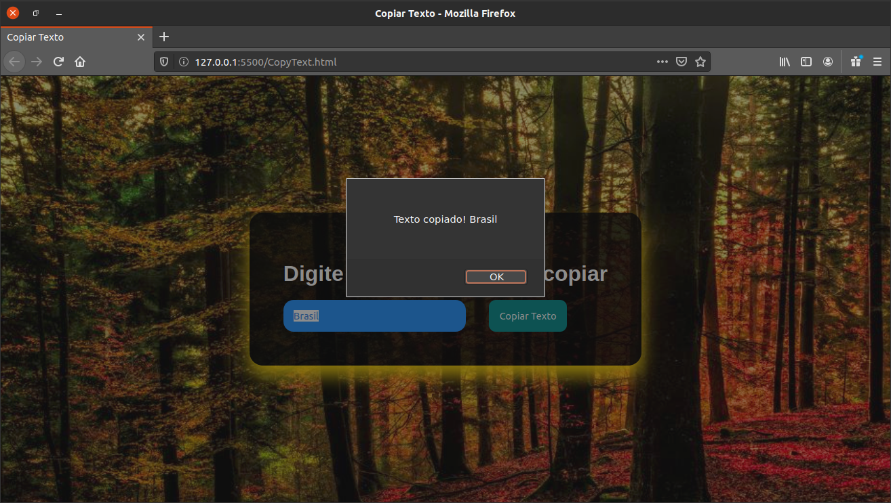
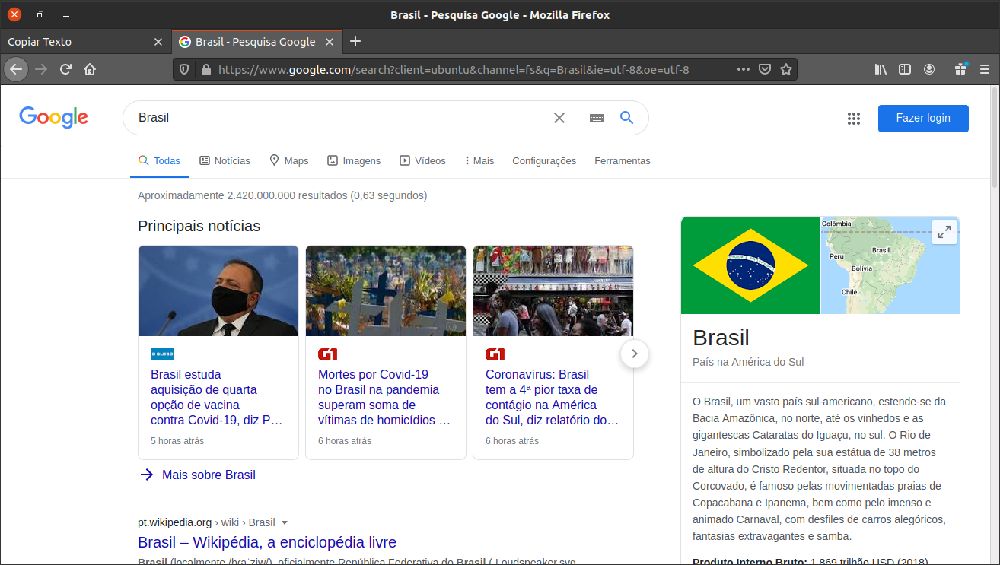

<h1 style="text-align: center">Projeto Copia e texto</h1>

É um projeto feito para copiar um texto e colar na barra de pesquisa.





<h1>
  
  Instalação
</h1> 

Para contribuir com a build do projeto, copie esse comando no seu terminal, para clonar o repositório.

Clone do repositório:
```
git clone https://github.com/DanielFreitasFerreira/Project_Copia_ColaTexto
```
<h1>
   
  Tecnologias usadas
</h1> 

<p style="font-size: 25px">
   
  HTML5
</p>
<p style="font-size: 25px">
   
  CSS3
</p>
<p style="font-size: 25px">
   
  Javascript
</p>
<p align="center">
  Daniel Freitas Ferreira - 2020
</p>